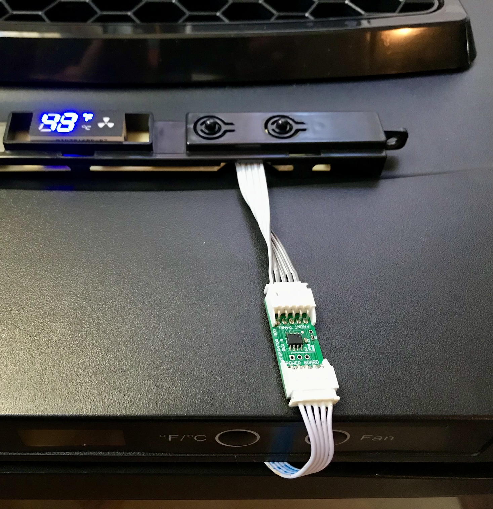

## Hardware

Designed in Altium CircuitMaker.  Contact me if you want access to the project files in the Altium cloud.

Install R1 to allow the fan control to work normally. There's an option to have the software override the fan speed, but that is not implemented yet. If using this option then do not install R1.

### Installation

- Unplug the kegerator AC power.
- Remove the three screws that secure the plastic panel under the temperature controller front panel.
- Remove the two screws that secure the temperature controller front pabel assembly.
- Disconnect the 5 pin cable from the temperature controller.
- Insert the kegerator_mod PCBA inline as shown. Use the short cable to connect it to the front panel.
- The board connectors are labeled "Front Panel" and "Power Board".  Make sure the "Front Panel" side faces the temperature controller front panel.  "Power Board" side connects to the 5-pin cable that travels back into the kegerator.
- Reassemble in reverse order.  Bend the cable as needed to fit the space available.
- Reattach kegerator AC power.

The unit should function as normal, with the exception that compressor minimum on-time and minimum off-time are enforced. Short glitches are filtered out.

