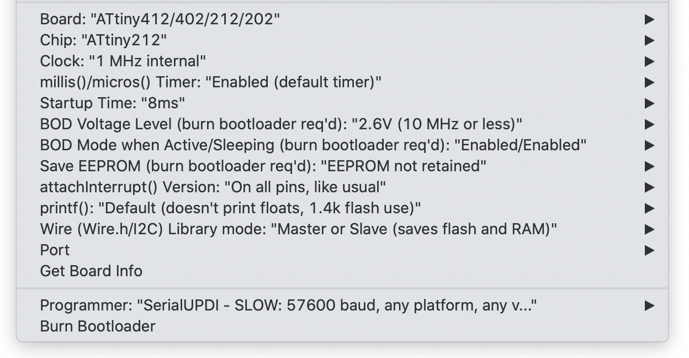

## Arduino sketch for ATTINY212

At the time of writing, the ATTINY212 is currently available at [Digikey](https://www.digikey.com/en/products/detail/microchip-technology/ATTINY212-SSN/9947536).

### Prerequisites

First, install these libraries:

```
https://github.com/SpenceKonde/megaTinyCore
https://github.com/contrem/arduino-timer
```

Configure as shown:



Burn the bootloader once to program the fuses. Then upload the sketch.
